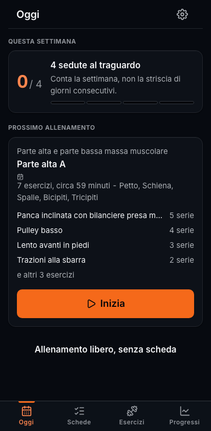
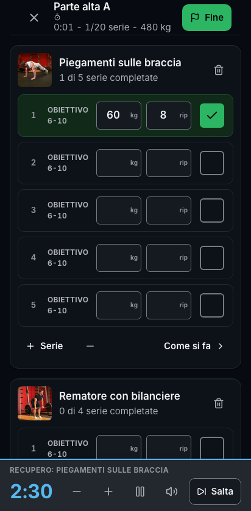
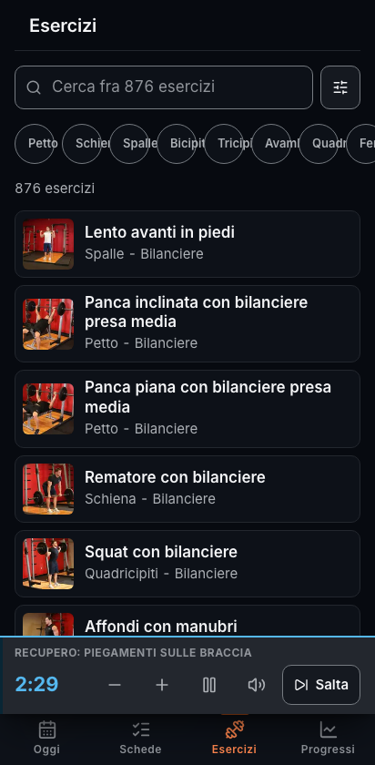
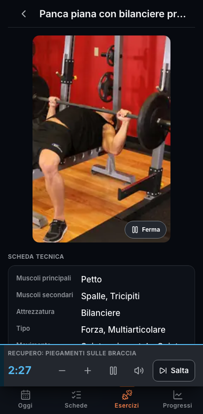
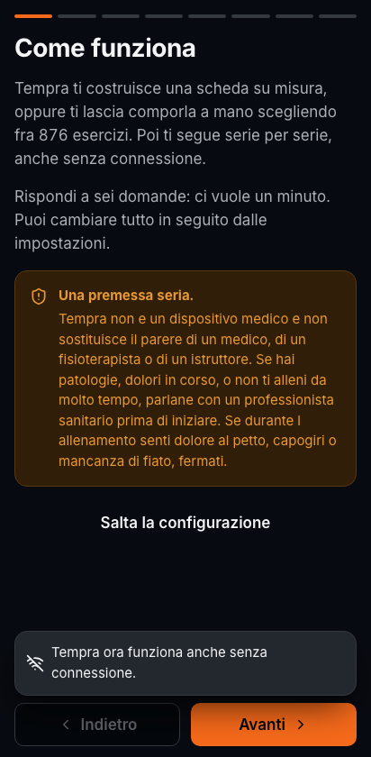
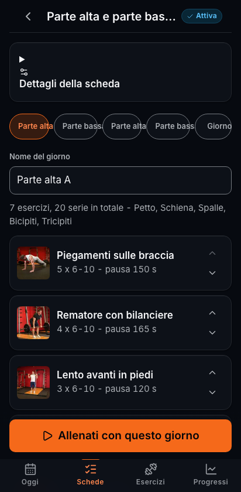
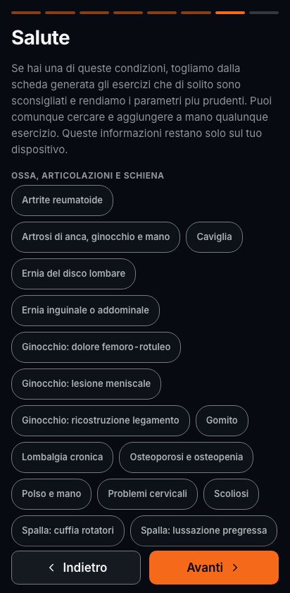

<div align="center">

# Tempra

**Costruisci le tue schede, generane una su misura, e registra ogni serie.
Anche quando in palestra non c'e' campo.**

Progressive Web App in italiano per allenarsi in palestra, a casa o all'aperto.
876 esercizi con immagini e istruzioni, generatore di schede basato sulla
letteratura scientifica, editor manuale, cronometro di recupero e storico dei
progressi. Funziona completamente offline e non richiede alcun account.

</div>

<div align="center">




</div>

---

## Indice

- [Cosa fa](#cosa-fa)
- [Guida rapida](#guida-rapida)
- [Come si usa](#come-si-usa)
- [Come funziona il generatore](#come-funziona-il-generatore)
- [Condizioni di salute](#condizioni-di-salute)
- [Accessibilita](#accessibilita)
- [Installazione sul telefono](#installazione-sul-telefono)
- [Sviluppo](#sviluppo)
- [La pipeline dei dati](#la-pipeline-dei-dati)
- [Deploy](#deploy)
- [Test](#test)
- [Struttura del repository](#struttura-del-repository)
- [Documentazione](#documentazione)
- [Licenze e crediti](#licenze-e-crediti)
- [Avvertenza](#avvertenza)

---

## Cosa fa

### Due modi per avere una scheda

**Te la generiamo noi.** Rispondi a sei domande (obiettivo, dove ti alleni, che
attrezzatura hai, quanti giorni, quanto tempo, che livello) e Tempra costruisce
un mesociclo completo: split adatto ai giorni disponibili, volume settimanale per
gruppo muscolare, serie, ripetizioni, ripetizioni di riserva e pause calcolate.
Prima di accettarla vedi **perche'** e' fatta cosi', e puoi chiederne un'altra.

**Te la fai tu.** Parti da una scheda vuota, aggiungi i giorni che vuoi, cerca fra
876 esercizi e componi tutto a mano. Per ogni esercizio imposti serie,
ripetizioni, carico, durata e pausa. La pausa arriva gia' calcolata in base
all'esercizio e al tuo obiettivo, con un collegamento per tornare al valore
consigliato se la cambi e poi ci ripensi.

### Ogni esercizio chiede solo quello che serve

Tempra sa di che tipo e' l'esercizio e mostra i campi giusti:

| Tipo di esercizio | Cosa ti chiede |
|---|---|
| Con sovraccarico (panca, squat, curl) | carico e ripetizioni |
| A corpo libero (piegamenti, affondi) | solo ripetizioni |
| A corpo libero zavorrabile (trazioni, dip) | ripetizioni piu' zavorra opzionale |
| A tempo (plank, wall sit, stretching) | secondi |
| Con elastici | ripetizioni e livello dell'elastico |

La pausa consigliata cambia di conseguenza: tre minuti dopo uno squat pesante,
quarantacinque secondi dopo delle alzate laterali, e per il plank si calcola sul
rapporto fra lavoro e recupero invece che sul carico.

### Durante l'allenamento

- **Un tocco per registrare una serie.** I campi arrivano gia' compilati con il carico dell'ultima volta: se ripeti la stessa serie, ti basta la spunta.
- **Il recupero parte da solo** quando spunti una serie, con suono, vibrazione e conto alla rovescia grande e leggibile a distanza. Puoi aggiungere o togliere quindici secondi, metterlo in pausa, saltarlo.
- **Lo schermo resta acceso** per tutta la sessione, e se il sistema spegne il blocco quando l'app va in secondo piano, Tempra lo riprende da sola.
- **Niente pulsante Salva.** Ogni valore viene scritto subito. Se il telefono si blocca o chiudi l'app per sbaglio, riapri e ritrovi l'allenamento esattamente dov'era.
- **Il timer non si ferma** quando il telefono va in standby: il tempo residuo si calcola dall'orologio, non contando i tick.

### Dopo

Riepilogo della sessione con durata, serie, tonnellaggio e i record personali
battuti. Tempra ne tiene quattro tipi per esercizio, perche' migliorare non
significa solo alzare piu' peso: carico massimo, ripetizioni a corpo libero,
volume della singola serie, massimale stimato, piu' il tempo per gli isometrici.

Nei progressi trovi il volume per allenamento, le serie per distretto muscolare,
l'andamento del massimale stimato esercizio per esercizio e lo storico completo.

---

## Guida rapida

Serve solo Docker.

```bash
git clone https://github.com/cpibia/tempra.git
cd tempra
cp .env.example .env

# Bastano due valori per partire
sed -i '' "s|^POSTGRES_PASSWORD=.*|POSTGRES_PASSWORD=$(openssl rand -base64 24)|" .env
sed -i '' "s|^JWT_SECRET=.*|JWT_SECRET=$(openssl rand -base64 48)|" .env

docker compose up --build -d
```

Apri <http://localhost:8080>.

Vuoi solo la PWA, senza database e senza sincronizzazione? E' lo scenario piu'
comune per uso personale:

```bash
docker compose up --build -d web
```

---

## Come si usa

### 1. Il primo avvio



Al primo avvio Tempra ti fa sei domande. Ci vuole un minuto e puoi **saltare
tutto** con un tocco: l'app resta pienamente utilizzabile, semplicemente non
potra' generarti una scheda finche' non compili il profilo.

Le domande sono:

1. **Obiettivo**: massa muscolare, dimagrimento, forza, ricomposizione, resistenza, salute.
2. **Dove ti alleni**: palestra attrezzata, casa con attrezzi, casa a corpo libero, all'aperto. Se non sei in palestra ti chiede anche che attrezzatura hai davvero.
3. **Quanti giorni e quanto tempo**: da due a sei giorni, sedute da trenta a novanta minuti.
4. **Livello**: principiante, intermedio, avanzato.
5. **Qualche dato su di te**: tutto facoltativo. Servono solo a proporre carichi di partenza sensati.
6. **Salute**: se hai condizioni che consigliano cautela.

<br clear="right" />

### 2. Genera la scheda, o falla tu



Alla fine dell'onboarding puoi chiedere la scheda o rifiutare.

Se la chiedi, Tempra ti mostra la proposta completa **prima** di salvarla: i
giorni, gli esercizi, le serie, le pause, la durata stimata, l'elenco delle scelte
fatte e quello degli esercizi esclusi per motivi di salute con il relativo motivo.
Se non ti convince, **"un'altra proposta"** ne genera una diversa.

Se preferisci fare da solo, vai in **Schede**, tocca **Nuova**, aggiungi i giorni
che vuoi e riempili cercando fra gli esercizi. Ogni esercizio si apre e ti lascia
impostare serie, ripetizioni, carico, durata, pausa e la modalita' delle serie
(normali, piramidale crescente o decrescente, stripping, rest pause).

Per riordinare gli esercizi usa le frecce su e giu': funzionano da tastiera e con
lo screen reader, che annuncia la nuova posizione.

<br clear="right" />

### 3. Allenati


Dalla home tocchi **Inizia** e parte la sessione. Tempra propone il giorno meno
recente della scheda, quindi la rotazione resta corretta anche se salti una seduta.

Nella schermata di allenamento:

- ogni riga e' una serie: numero, obiettivo, cosa hai fatto la volta scorsa, i campi da compilare e la spunta;
- la spunta e' grande e presa su tutta la sua area: si centra con il pollice senza guardare;
- **Serie** aggiunge una serie, il meno toglie l'ultima;
- **Come si fa** apre la scheda dell'esercizio con le immagini e le istruzioni;
- **Aggiungi esercizio** ti fa infilare qualcosa che non era in programma;
- in alto vedi il tempo trascorso, le serie completate e i chili sollevati.

Quando spunti una serie il recupero parte da solo. La barra in basso mostra il
conto alla rovescia, diventa ambra negli ultimi dieci secondi e verde quando il
recupero e' finito, poi conta il tempo in eccesso. Se non vuoi il suono o la
vibrazione, si spengono dalle impostazioni.

Alla fine tocchi **Fine**: le serie non spuntate non vengono registrate, e il
riepilogo ti dice com'e' andata.

<br clear="right" />

### 4. Il catalogo


876 esercizi, tutti con nome e istruzioni in italiano, quasi tutti con due foto
che si alternano per mostrare il movimento (puoi fermarle, e se hai chiesto al
sistema meno animazioni partono gia' ferme).

Cerca per nome, anche in inglese o con le abbreviazioni che usi in palestra
("lat machine", "stacco", "panca"), oppure filtra per gruppo muscolare,
attrezzatura e livello.

Ogni scheda esercizio mostra i muscoli coinvolti, l'attrezzatura, il pattern di
movimento, la pausa consigliata, le istruzioni passo per passo e, se lo hai gia'
fatto, il tuo storico con il massimale stimato.

<br clear="right" />

### 5. I tuoi dati

Tempra tiene **tutto sul tuo dispositivo**, in IndexedDB. Niente account, niente
server, niente da fidarsi.

La conseguenza da tenere a mente: se cancelli i dati del browser o cambi
telefono, senza backup non si recupera nulla. Dalle impostazioni puoi:

- **scaricare un backup** completo in JSON (profilo, schede, allenamenti, record, misure);
- **ripristinarlo** su un altro dispositivo;
- **cancellare tutto** in modo definitivo.

Se hai installato anche il backend, puoi creare un account e attivare la
sincronizzazione: gli allenamenti vengono copiati sul server e li ritrovi altrove.
Resta facoltativo, e si puo' disattivare in qualsiasi momento.

---

## Come funziona il generatore

Il motore e' **deterministico e spiegabile**: nessun modello statistico, nessuna
chiamata a servizi esterni. Una catena di regole numeriche, ognuna con una fonte
nella letteratura, che produce anche l'elenco delle proprie motivazioni.

```
giorni + livello + obiettivo   →  scelta dello split
livello + obiettivo + recupero →  volume settimanale per gruppo (modello MEV/MAV/MRV)
split + attrezzatura + salute  →  selezione degli esercizi per ogni posizione
volume / frequenza             →  serie per esercizio, con un tetto per seduta
obiettivo + ruolo + livello    →  ripetizioni e ripetizioni di riserva
formula deterministica         →  pausa consigliata
condizioni di salute           →  adattamento di carico, ripetizioni e pause
tempo dichiarato               →  riduzione progressiva fino a starci dentro
```

Qualche numero, per dare l'idea del livello di dettaglio:

- **Volume**: tabella MEV, MAV e MRV per dodici gruppi muscolari e tre livelli. Un petto intermedio parte da 12 serie settimanali e puo' arrivare a 22. Il tetto per singola seduta e' 6 serie per un principiante, 9 per un intermedio, 12 per un avanzato.
- **Pausa**: `BASE[obiettivo] x K_esercizio x K_intensita x K_sforzo x K_livello`, arrotondata a quindici secondi. Uno squat pesante per la forza arriva a 300 secondi, delle alzate laterali per il dimagrimento a 45.
- **Massimale stimato**: media di piu' formule in funzione delle ripetizioni (Epley, Brzycki, Lander e Wathan fino a cinque ripetizioni, meno formule oltre, solo Epley sulle serie lunghe dove le altre divergono).
- **Split**: due giorni total body A e B, tre giorni total body A, B e C, quattro giorni parte alta e parte bassa, cinque e sei giorni spinta, trazione e gambe.

Tutta la ricerca alla base sta in
[`docs/research/01-scienza-allenamento.md`](docs/research/01-scienza-allenamento.md):
110 KB di linee guida ACSM e NSCA, meta analisi e tabelle operative, con le fonti
citate per ogni numero. Le decisioni di progetto sono in
[`docs/adr/0003-motore-di-generazione.md`](docs/adr/0003-motore-di-generazione.md).

---

## Condizioni di salute



Nell'onboarding puoi indicare condizioni che consigliano cautela: 32 in tutto, da
ernia del disco e cuffia dei rotatori a ipertensione, osteoporosi, diabete,
gravidanza per trimestre, post partum e allenamento da seduti.

Quello che succede:

- gli esercizi comunemente sconsigliati **non entrano** nelle schede generate, e ti viene detto quali e perche';
- i parametri diventano piu' prudenti: piu' ripetizioni, meno intensita', pause piu' lunghe, mai vicino al cedimento;
- quando la condizione lo richiede, Tempra dice chiaramente di **sentire prima un medico**;
- aprendo un esercizio escluso, la sua scheda ti spiega il motivo;
- puoi comunque **aggiungerlo a mano** alla tua scheda: se il tuo fisioterapista ti dice che puoi farlo, ha ragione lui.

Queste informazioni **non lasciano il dispositivo** a meno che tu non attivi la
sincronizzazione creando un account.

Le regole vengono dalla ricerca clinica in
[`docs/research/03-salute-sicurezza.md`](docs/research/03-salute-sicurezza.md),
e sono risolte in liste esplicite di esercizi durante la build, non con
espressioni regolari sui nomi a runtime: il motivo e' spiegato
[nell'ADR 0004](docs/adr/0004-filtri-sanitari.md), e ha a che fare con il fatto
che la parola "run" si nasconde dentro "crunch".

<br clear="right" />

---

## Accessibilita

Obiettivo dichiarato: **WCAG 2.1 livello AA**, con i criteri rilevanti di WCAG 2.2.
La verifica con axe-core gira in automatico su cinque schermate, in tema chiaro e
scuro, a 412 e a 320 pixel di larghezza, e **fa fallire la build** se trova una
violazione.

Cosa significa in pratica:

- **contrasti calcolati, non stimati**: ogni coppia di colori e' stata verificata a mano su entrambi i temi;
- **bersagli di tocco da almeno 44 pixel**, 48 per la navigazione e per la schermata di allenamento;
- **il colore non porta mai da solo un'informazione**: una serie completata ha la spunta, un record ha l'icona e l'etichetta, i grafici hanno la forma del marcatore e una tabella dati equivalente;
- **il timer non spamma**: il conto alla rovescia sta in un `role="timer"`, che gli screen reader non rileggono a ogni secondo, e l'annuncio avviene solo alle soglie di 60, 30, 10 e 5 secondi e alla fine. C'e' anche un pulsante per farsi leggere il tempo rimanente su richiesta;
- **niente trascinamento obbligatorio**: gli esercizi si riordinano con due pulsanti che funzionano da tastiera e annunciano la nuova posizione;
- **elementi nativi ovunque**: `button`, `input`, `dialog`. Le finestre modali usano `showModal()`, quindi il confinamento del focus, la chiusura con Escape e l'inertizzazione del resto della pagina arrivano dal browser;
- **l'animazione delle foto si ferma**, e parte gia' ferma se hai chiesto al sistema meno animazioni;
- **testo ingrandibile al 200%** senza rompere il layout, nessun `user-scalable=no`.

La guida operativa completa, con il codice dei pattern usati, sta in
[`docs/research/04-accessibilita-wcag.md`](docs/research/04-accessibilita-wcag.md).

> La CI verde non e' conformita'. Prima di un rilascio serio, vale la pena fare
> un allenamento intero con VoiceOver attivo e lo schermo oscurato.

---

## Installazione sul telefono

Tempra e' una PWA: si installa dal browser, senza store.

**iPhone e iPad (Safari)**
1. Apri l'indirizzo in Safari (non in Chrome: su iOS solo Safari puo' installare).
2. Tocca il pulsante Condividi.
3. Scorri e scegli **Aggiungi alla schermata Home**.

**Android (Chrome)**
1. Apri l'indirizzo.
2. Menu a tre puntini, poi **Installa app** o **Aggiungi a schermata Home**.

Dopo l'installazione l'app si apre a schermo intero, senza barra del browser, e
funziona senza connessione. Le immagini degli esercizi si scaricano mano a mano
che le incontri, quindi dopo il primo allenamento gli esercizi della tua scheda
sono disponibili anche offline.

---

## Sviluppo

**Prerequisiti**: Node 22 o superiore. Per rigenerare le immagini serve anche
ImageMagick.

```bash
git clone https://github.com/cpibia/tempra.git
cd tempra
npm install

npm run dev          # PWA su http://localhost:5173
npm run dev:api      # API su http://localhost:3000 (richiede DATABASE_URL)
```

Comandi disponibili:

| Comando | Cosa fa |
|---|---|
| `npm run dev` | Avvia la PWA in sviluppo |
| `npm run build` | Compila la PWA per la produzione |
| `npm run build:api` | Compila l'API |
| `npm run typecheck` | Controlla i tipi su tutti i pacchetti |
| `npm run test` | Test unitari (69 test) |
| `npm run test:e2e` | Test end to end e verifica WCAG (46 test) |
| `npm run data:all` | Rigenera immagini, catalogo e regole sanitarie |
| `npm run docker:up` | Avvia lo stack completo in Docker |

---

## La pipeline dei dati

Il catalogo non e' scritto a mano: si genera dal dataset pubblico
[free-exercise-db](https://github.com/yuhonas/free-exercise-db).

```bash
# Il dataset sorgente va clonato accanto al progetto
git clone https://github.com/yuhonas/free-exercise-db.git db-exercise

npm run data:images       # 1.746 JPEG (101 MB) → WebP (26 MB)
npm run data:catalog      # → catalogo normalizzato con i campi derivati
npm run data:conditions   # → regole sanitarie risolte in liste di esercizi
```

`build-catalog.mjs` non traduce soltanto: **deriva** i campi che il motore usa e
che il dataset originale non ha. Per ogni esercizio calcola il pattern di
movimento (squat, hinge, spinta orizzontale, trazione verticale...), il tipo di
carico (che decide quali campi mostrare durante l'allenamento), se e'
unilaterale, l'impatto articolare, se comprime la colonna sotto carico, se si
puo' fare a casa, una priorita' interna e la pausa di partenza.

I dettagli sono in [`docs/architettura.md`](docs/architettura.md).

---

## Deploy

### Docker

```bash
cp .env.example .env    # completare POSTGRES_PASSWORD e JWT_SECRET
docker compose up --build -d
```

Tre servizi: `web` (nginx, porta 8080), `api` (Node, porta 3000), `db`
(Postgres, non esposto). Entrambe le immagini girano con utente non privilegiato
e hanno un healthcheck. Le migrazioni del database vengono applicate
automaticamente all'avvio del container dell'API.

Per la sola PWA, senza backend: `docker compose up --build -d web`.

### Coolify

La guida completa passo per passo e' in
[`docs/deploy/coolify.md`](docs/deploy/coolify.md), con entrambi gli scenari,
la tabella di tutte le variabili d'ambiente e la sezione di troubleshooting.

Un avvertimento che vale la pena ripetere qui: **`VITE_API_URL` e' una variabile
di build, non di runtime**. Entra nel bundle JavaScript quando l'immagine viene
compilata, quindi su Coolify va impostata come build variable. Configurarla come
semplice variabile d'ambiente del container non ha alcun effetto, ed e' l'errore
piu' comune con questo tipo di stack.

---

## Test

```bash
npm run test        # 69 test unitari
npm run test:e2e    # 46 test end to end, verifica WCAG inclusa
```

Cosa coprono:

- **Motore** (47 test): formule del massimale e loro coerenza reciproca, tabella ripetizioni e percentuali, rilevamento dei record, e un blocco di invarianti sul generatore verificate su **360 combinazioni** di obiettivo, luogo, livello e giorni. Fra le invarianti: nessun esercizio ripetuto nella stessa seduta, mai attrezzatura non disponibile, mai stretching negli slot di forza, durata sempre entro il tempo dichiarato, volume sopra il minimo efficace sui grandi distretti, e nessun esercizio escluso per salute che rientra dalla finestra.
- **API** (11 test): hash delle password, verifica a tempo costante, robustezza su hash malformati, e il limite sui calcoli in parallelo che impedisce a una raffica di accessi di esaurire la memoria.
- **PWA** (11 test): il timer di recupero, con particolare attenzione al fatto che il tempo si legge dall'orologio e sopravvive a un ricaricamento della pagina.
- **End to end** (46 test): il percorso completo dall'onboarding al riepilogo, il ripristino della sessione dopo un reload, la ricerca nel catalogo, l'assenza di scorrimento orizzontale su ogni schermata, e la verifica WCAG con axe su cinque schermate per due temi e due larghezze di schermo.

I test hanno trovato difetti veri durante lo sviluppo, non solo confermato il
codice: un errore di classificazione per cui "Crunch" veniva riconosciuto come
esercizio ad alto impatto (la parola "run" e' dentro "crunch"), la barra del
recupero tagliata a 320 pixel, un profilo appena creato che veniva rimandato
all'onboarding per una condizione di corsa, scrypt che falliva in container per
il limite di memoria predefinito di Node, e uno scorrimento orizzontale su tutta
la pagina causato dalla larghezza minima automatica di una colonna di griglia.

Il progetto e' passato anche per una **revisione di sicurezza** completa, i cui
quattro rilievi di gravita' alta sono stati corretti e verificati: le condizioni
di salute non lasciano piu' il dispositivo nemmeno con la sincronizzazione
attiva, le risposte dell'API non finiscono piu' in Cache Storage, l'intestazione
`X-Forwarded-For` non e' piu' falsificabile per aggirare i limiti sulle
richieste, e i calcoli di hash hanno un tetto di parallelismo. Il rapporto
completo, con lo stato di ogni rilievo, e' in
[`docs/security-review.md`](docs/security-review.md).

---

## Struttura del repository

```
tempra/
├── apps/
│   ├── web/              PWA React: l'applicazione
│   └── api/              API di sincronizzazione (facoltativa)
├── packages/
│   └── core/             dominio condiviso: motore, catalogo, salute
├── tools/                pipeline dati
├── docs/
│   ├── research/         la ricerca alla base (500 KB, con le fonti)
│   ├── adr/              le decisioni di progetto e il loro perche'
│   ├── design/           design system e token
│   ├── deploy/           guida Coolify
│   └── architettura.md
├── docker-compose.yml
└── .env.example
```

---

## Documentazione

| Documento | Contenuto |
|---|---|
| [`docs/architettura.md`](docs/architettura.md) | Mappa del codice, flusso principale, pipeline dati, scelte di prestazione |
| [`docs/adr/`](docs/adr/) | Le cinque decisioni strutturali, con alternative valutate e conseguenze |
| [`docs/research/01-scienza-allenamento.md`](docs/research/01-scienza-allenamento.md) | Volume, intensita', pause, split, progressione, periodizzazione. Con le fonti |
| [`docs/research/02-benchmark-app-ux.md`](docs/research/02-benchmark-app-ux.md) | Analisi di 4.379 recensioni negative delle app concorrenti e cosa se ne ricava |
| [`docs/research/03-salute-sicurezza.md`](docs/research/03-salute-sicurezza.md) | 32 condizioni, screening, quadro normativo, limiti del dispositivo medico |
| [`docs/research/04-accessibilita-wcag.md`](docs/research/04-accessibilita-wcag.md) | Guida operativa WCAG per ogni componente dell'app, con il codice |
| [`docs/design/01-design-system.md`](docs/design/01-design-system.md) | Direzione visiva, palette con i contrasti calcolati, tipografia, componenti |
| [`docs/deploy/coolify.md`](docs/deploy/coolify.md) | Deploy su Coolify, variabili, domini, backup, troubleshooting |
| [`docs/security-review.md`](docs/security-review.md) | Revisione di sicurezza con i rilievi e le patch |

---

## Licenze e crediti

Il codice di Tempra e' rilasciato sotto licenza MIT.

Il catalogo di 876 esercizi, immagini comprese, proviene da
[free-exercise-db](https://github.com/yuhonas/free-exercise-db) di Yuho Nas,
rilasciato in pubblico dominio con licenza
[Unlicense](https://unlicense.org/). Nomi, alias e istruzioni sono stati tradotti
in italiano e il dataset e' stato arricchito con i campi derivati che servono al
motore.

Il carattere tipografico e' [Inter](https://rsms.me/inter/) di Rasmus Andersson
(SIL Open Font License 1.1), servito dal dominio dell'applicazione.
Le icone sono [Lucide](https://lucide.dev/) (ISC License).

---

## Avvertenza

**Tempra non e' un dispositivo medico.** Quello che trovi qui e' materiale
informativo, non una prescrizione, e non sostituisce il parere di un medico, di
un fisioterapista o di un istruttore qualificato.

Se hai patologie, dolori in corso, o non ti alleni da molto tempo, parlane con un
professionista sanitario prima di iniziare. Interrompi subito l'allenamento in
caso di dolore al petto, capogiri, mancanza di fiato o dolore acuto.

I filtri sanitari dell'applicazione sono una precauzione conservativa basata su
linee guida generali. Non conoscono la tua storia clinica e non possono
sostituire una valutazione individuale.
